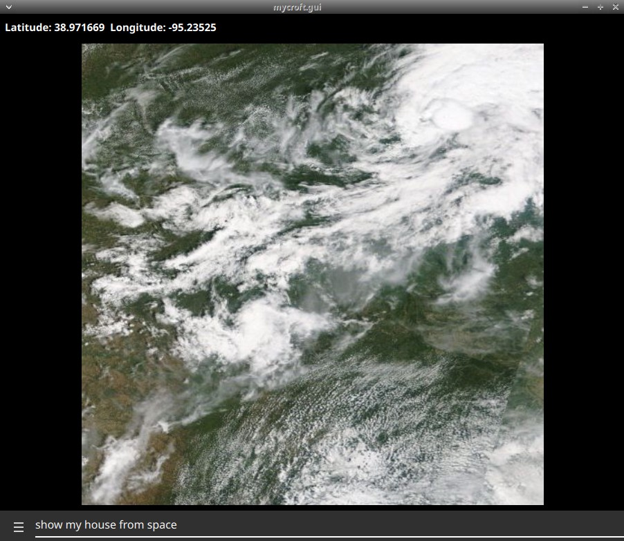
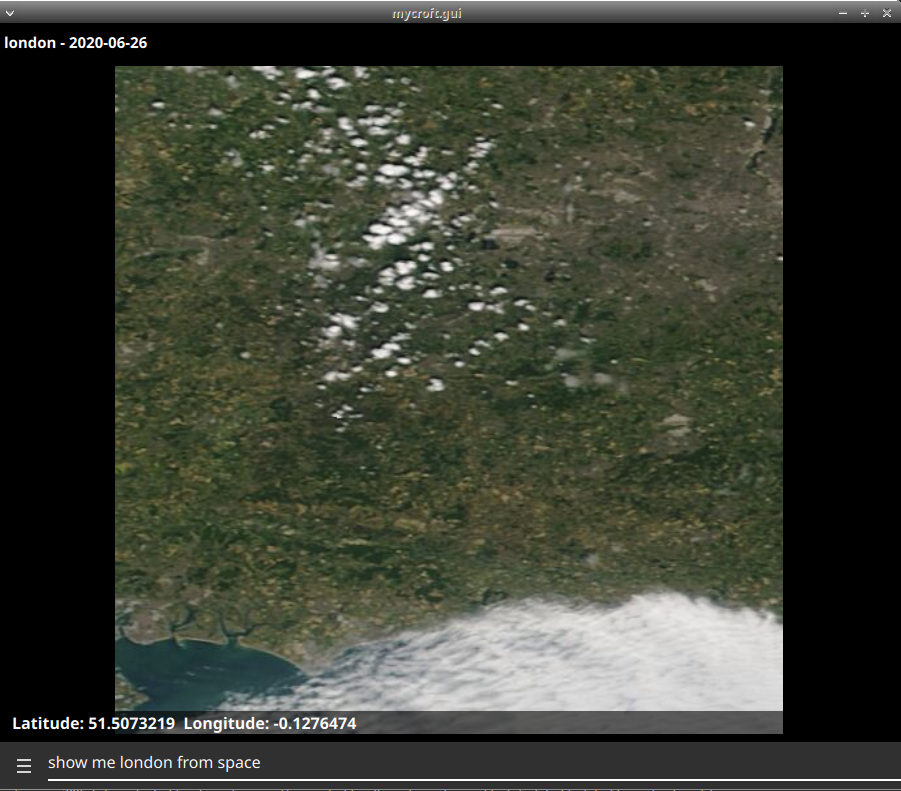
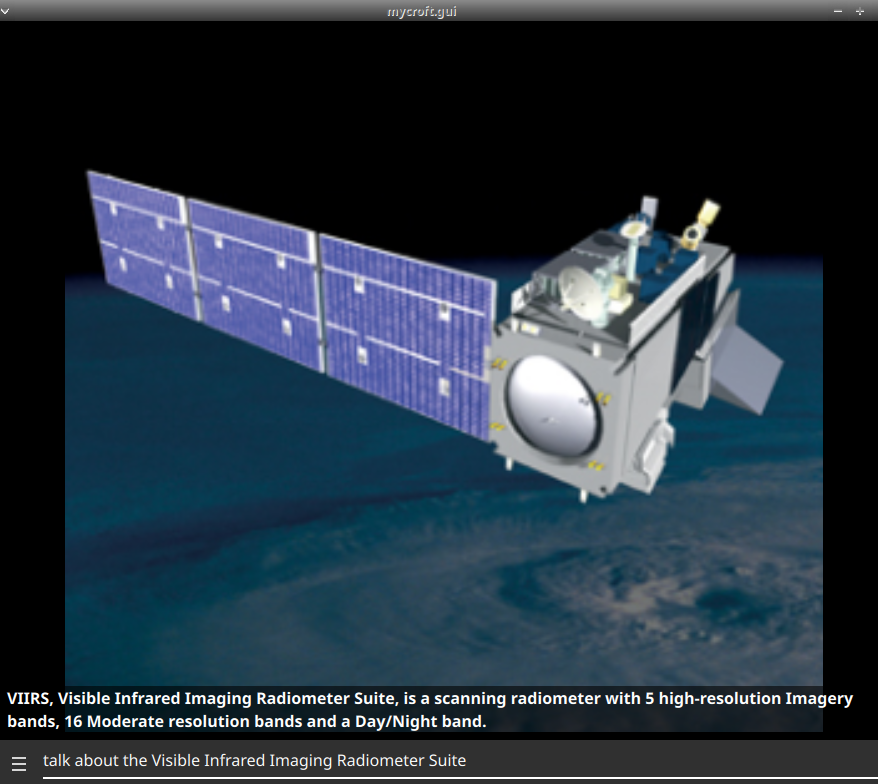
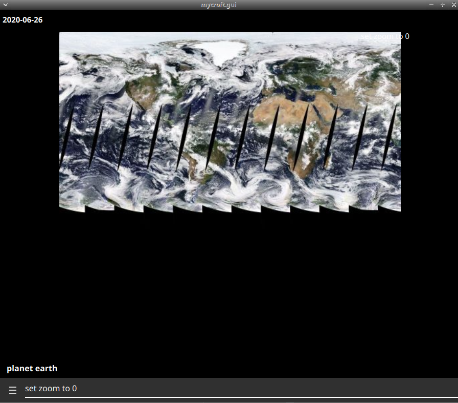

#  Visible Infrared Imaging Radiometer Suite

## About

Near real time Satellite imagery from NASA's [Visible Infrared Imaging Radiometer Suite](https://wiki.earthdata.nasa.gov/display/GIBS/2015/12/10/VIIRS+is+Here)
  
Can be used as idle screen for the mark2

## Examples
* "show my location from space"
* "show me london from space"
* "next picture"
* "previous picture"
* "show my house from space last month"
* "increase zoom"
* "zoom out"
* "set zoom to maximum"
* "why so many clouds"
* "explain the holes in the equator"
* "talk about Visible Infrared Imaging Radiometer Suite"

## Credits
- JarbasAi
- [NASA](https://wiki.earthdata.nasa.gov/display/GIBS/2015/12/10/VIIRS+is+Here)

## Category
**Entertainment**

## Tags
#nasa
